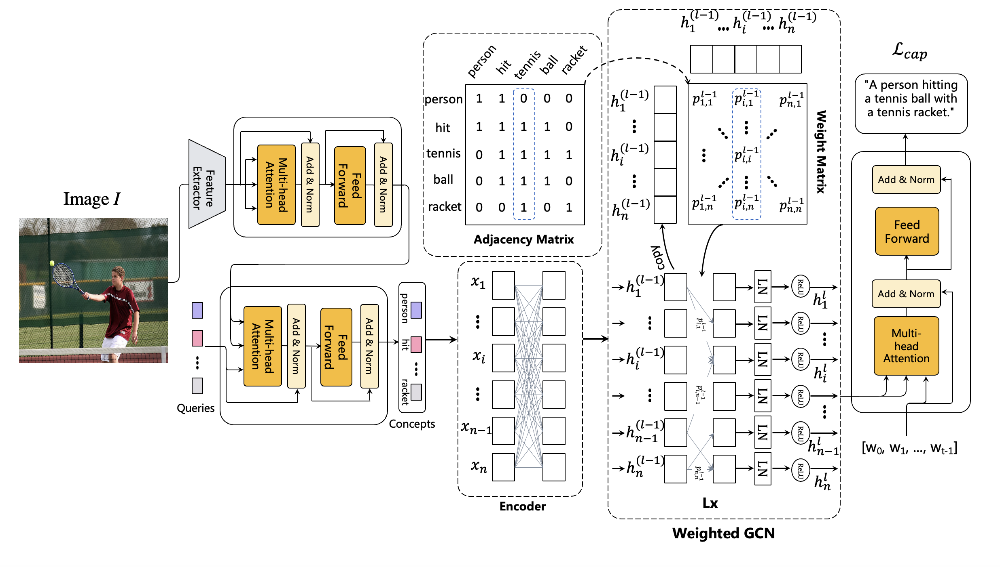

# Image Captioning via Predicting Structured Concepts

This repository implements the encoder block of the research paper "Improving image captioning via predicting structured concepts". The encoder block is a crucial component in the image captioning model described in the paper.

## Introduction

In this project, we aim to improve the quality of image captions by incorporating structured concepts. The encoder block processes input images and extracts meaningful features, which are then used by the captioning model to generate descriptive captions.

## Research Paper

The implementation in this repository is based on the following research paper:

- **Title**: Improving image captioning via predicting structured concepts
- **Authors**: [Ting Wang, Weidong Chen, Yuanhe Tian, Yan Song, Zhendong Mao]
- **Link**: [[Research Paper Link](https://arxiv.org/pdf/2311.08223.pdf)]

## Framework Overview

The image above provides an overview of the framework used in the research paper.
